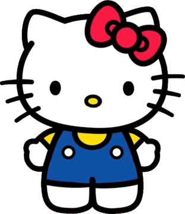
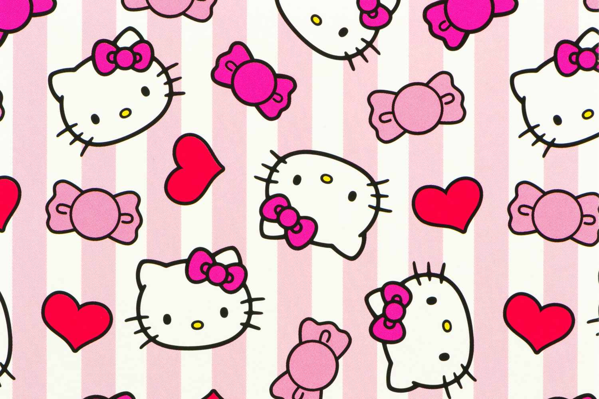

---
output:
  md_document:
    variant: markdown_github
---

# Hello Kitty Color Palettes

<!-- badges: start -->

[](https://github.com/abigailkeller/hellokitty/actions/workflows/R-CMD-check.yaml)

<!-- badges: end -->


```{r, echo = FALSE}
knitr::opts_chunk$set(
  collapse = TRUE,
  comment = "#>",
  fig.path = "figure/",
  fig.height = 1
)
```

## Installation

``` {r, eval = FALSE}
install.packages("hellokitty")

```

**Or the development version**

``` {r, eval = FALSE}
devtools::install_github("abigailkeller/hellokitty")
```


## Palettes

```{r, palettes_dummy, message = FALSE, warning = FALSE}
library(hellokitty)
```

`hellokitty` contains two color palettes:

### Hello Kitty Palette 1

{height=2in}

[Image Source](https://hellokitty.fandom.com/wiki/Hello_Kitty)

```{r, hellokitty1, fig.height=1}
hkitty_palette("hellokitty1")
```

### Hello Kitty Palette 2

{height=2in}

[Image Source](https://www.parents.com/why-is-hello-kitty-so-popular-11851589)

```{r, hellokitty2}
hkitty_palette("hellokitty2")
```


## Example usage

The `hellokitty` package can be used to create both discrete and continuous color scales.

### Example 1: Discrete color scale

First we will get data showing the number of Pacific salmon returning to the Columbia River Basin based on visual observations at Bonneville Dam.

```{r, message = FALSE, warning = FALSE}
library(tidyverse)

# get CRB salmon
salmon <- c("Chinook", "Chum", "Coho", "Pink", "Sockeye")
CRB_salmon <- CRB_long[CRB_long$Species %in% salmon, ]
```

We will then create a discrete color palette based on the different salmon species.

```{r}
n_colors <- length(salmon)
pal1 <- hkitty_palette(name = "hellokitty2", n = n_colors, type = "discrete")
```

And we will plot the counts of salmon returns to Bonneville Dam over time:

```{r, fig.width=6, fig.height=3, message = FALSE, warning = FALSE, out.width="75%"}
ggplot(data = CRB_salmon) +
  geom_line(aes(x = year_label, y = total_value, color = Species)) +
  scale_color_manual(values = pal1) +
  labs(x = "Year", y = "Count", color = "Species") +
  ggtitle(paste0("Annual counts of salmon returns to Bonneville\nDam in the ", 
                 "Columbia River Basin")) +
  theme_minimal() +
  theme(plot.title = element_text(hjust = 0.5, size = 14),
        legend.title = element_text(hjust = 0.5)
  )
```


### Example 2: Continuous color scale

Now we will get a continuous color scale:

```{r}
pal2 <- hkitty_palette(name = "hellokitty1", type = "continuous")
```

And use it to plot the relationship between the count of Chinook salmon, shad, and lamprey returning to the Columbia River:

```{r, fig.width=6, fig.height=3, message = FALSE, warning = FALSE, out.width="75%"}
ggplot(data = CRB_wide[CRB_wide$Lamprey > 0, ]) +
  geom_point(aes(x = log(Chinook), y = log(Shad), color = log(Lamprey))) +
  scale_color_gradientn(colors = pal2) +
  labs(x = "Chinook (log count)", y = "Shad (log count)", 
       color = "Lamprey\n (log count)") +
  ggtitle("Fish co-occurrence in the Columbia River Basin") +
  theme_minimal() +
  theme(plot.title = element_text(hjust = 0.5, size = 14),
        legend.title = element_text(hjust = 0.5)
  )
```

### Notes

Code adapted from the [wesanderson](https://github.com/karthik/wesanderson/tree/master) R package.

