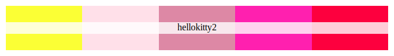
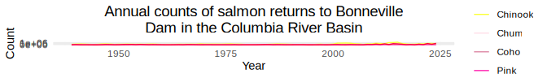
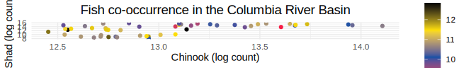

# Hello Kitty Color Palettes

<!-- badges: start -->

[](https://github.com/abigailkeller/hellokitty/actions/workflows/R-CMD-check.yaml)

<!-- badges: end -->

## Installation

``` r
```

**Or the development version**

``` r
# devtools::install_github("abigailkeller/hellokitty")
```

## Usage

``` r
library(hellokitty)
library(tidyverse)
#> ── Attaching core tidyverse packages ──────────────────────── tidyverse 2.0.0 ──
#> ✔ dplyr     1.2.1     ✔ readr     2.2.0
#> ✔ forcats   1.0.1     ✔ stringr   1.6.0
#> ✔ ggplot2   4.0.3     ✔ tibble    3.3.1
#> ✔ lubridate 1.9.5     ✔ tidyr     1.3.2
#> ✔ purrr     1.2.2     
#> ── Conflicts ────────────────────────────────────────── tidyverse_conflicts() ──
#> ✖ dplyr::filter() masks stats::filter()
#> ✖ dplyr::lag()    masks stats::lag()
#> ℹ Use the conflicted package (<http://conflicted.r-lib.org/>) to force all conflicts to become errors

# See all palettes
names(hkitty_palettes)
#> [1] "hellokitty1" "hellokitty2"
```

## Palettes

### Hello Kitty Palette 1


[Image Source](https://hellokitty.fandom.com/wiki/Hello_Kitty)

``` r
hkitty_palette("hellokitty1")
```


 \### Hello Kitty
Palette 2

[Image
Source](https://www.parents.com/why-is-hello-kitty-so-popular-11851589)

``` r
hkitty_palette("hellokitty2")
```



## Example usage

``` r
# get CRB salmon
salmon <- c("Chinook", "Chum", "Coho", "Pink", "Sockeye")
CRB_salmon <- CRB_long[CRB_long$Species %in% salmon, ]

n_colors <- length(salmon)
pal2 <- hkitty_palette(name = "hellokitty2", n = n_colors, type = "discrete")

ggplot(data = CRB_salmon) +
  geom_line(aes(x = year_label, y = total_value, color = Species)) +
  scale_color_manual(values = pal2) +
  labs(x = "Year", y = "Count", color = "Species") +
  ggtitle(paste0("Annual counts of salmon returns to Bonneville\nDam in the ", 
                 "Columbia River Basin")) +
  theme_minimal() +
  theme(plot.title = element_text(hjust = 0.5, size = 14),
        legend.title = element_text(hjust = 0.5)
  )
#> Warning: Removed 5 rows containing missing values or values outside the scale range
#> (`geom_line()`).
```



``` r
pal1 <- hkitty_palette(name = "hellokitty1", type = "continuous")

ggplot(data = CRB_wide[CRB_wide$Lamprey > 0, ]) +
  geom_point(aes(x = log(Chinook), y = log(Shad), color = log(Lamprey))) +
  scale_color_gradientn(colors = pal1) +
  labs(x = "Chinook (log count)", y = "Shad (log count)", 
       color = "Lamprey\n (log count)") +
  ggtitle("Fish co-occurrence in the Columbia River Basin") +
  theme_minimal() +
  theme(plot.title = element_text(hjust = 0.5, size = 14),
        legend.title = element_text(hjust = 0.5)
  )
```



### Notes

Code adapted from the
[wesanderson](https://github.com/karthik/wesanderson/tree/master) R
package.
